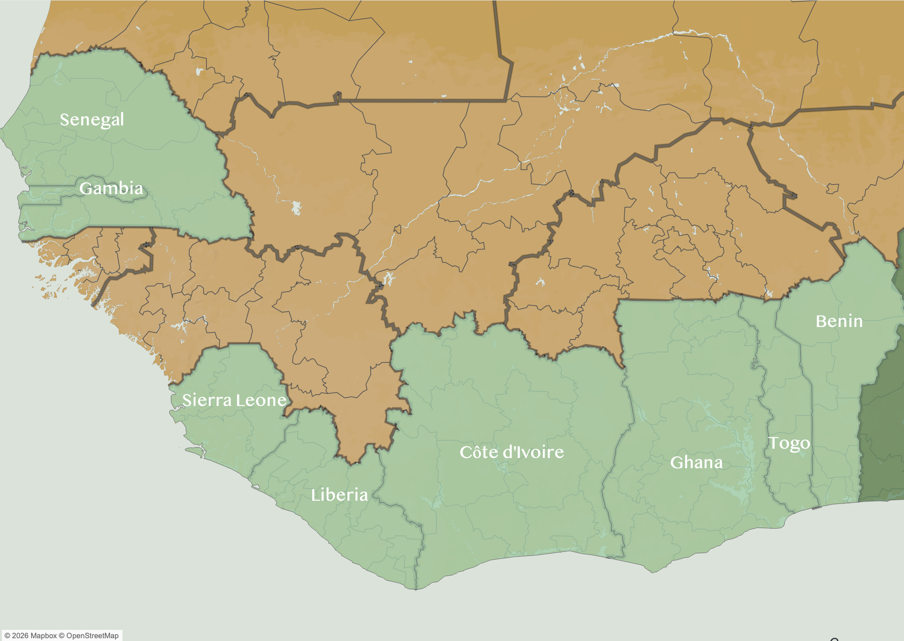
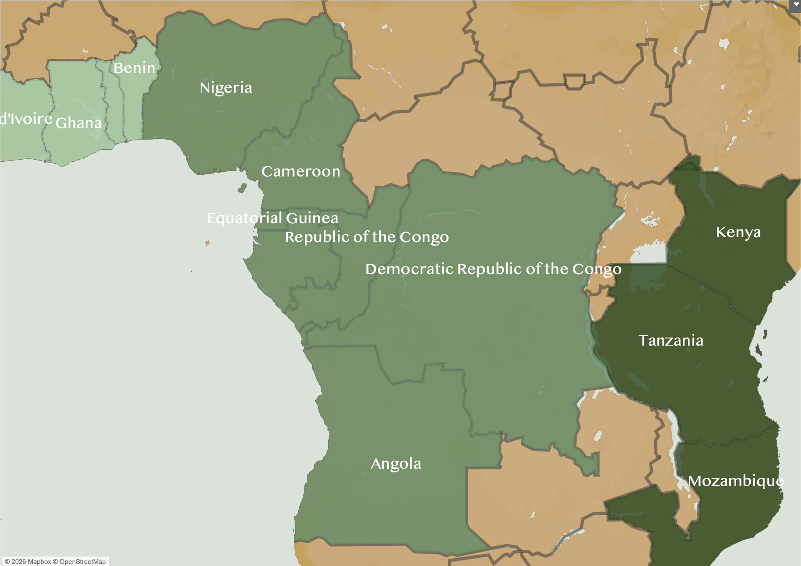
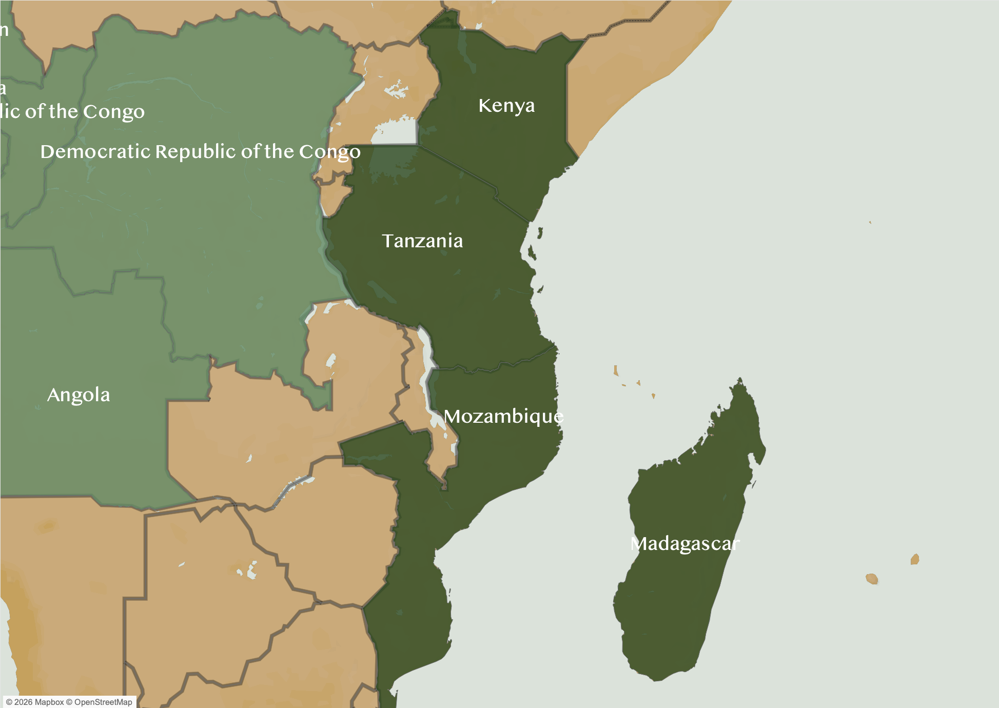
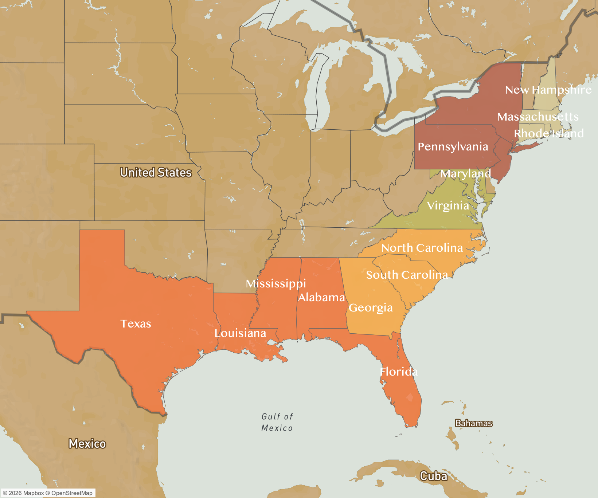

```{=html}
<link rel="preconnect" href="https://fonts.googleapis.com">
<link rel="preconnect" href="https://fonts.gstatic.com" crossorigin>

<link
  href="https://fonts.googleapis.com/css2?family=Cormorant+Garamond:wght@500;600;700&family=Source+Sans+3:wght@300;400;500;600&display=swap"
  rel="stylesheet"
>

<style>
:root {
  --paper: #F9F5EE;
  --paper-transparent: rgba(249, 245, 238, 0.9);
  --ink: #1D2129;
}

html,
body {
  margin: 0;
  padding: 0;
  background: var(--paper);
  color: var(--ink);
  font-family: "Source Sans 3", sans-serif;
}

h1,
h2,
h3 {
  font-family: "Cormorant Garamond", serif;
}

/* Hero */

.hero {
  min-height: 100vh;
  display: grid;
  place-content: center;
  padding: 2rem;
  text-align: center;
  background: var(--paper);
}

.hero h1 {
  margin: 0;
  font-size: clamp(4rem, 9vw, 7rem);
  line-height: 0.95;
}

.hero h2 {
  max-width: 800px;
  margin: 1rem auto 0;
  font-size: clamp(1.5rem, 3vw, 2.5rem);
  font-weight: 500;
}

/* Pinned map images */

.cr-section img {
  max-width: 900px;
  width: 100%;
  height: auto;
  display: block;
  margin: 0 auto;
  object-fit: contain;
}

/* Narrative cards */

.cr-section .map-step {
  width: min(500px, calc(100vw - 3rem));
  box-sizing: border-box;
  margin-left: 2rem;
  padding: 2rem;
  background: var(--paper-transparent);
  border-radius: 16px;
  box-shadow: 0 10px 30px rgba(0, 0, 0, 0.2);
}

.map-step h1,
.map-step h2 {
  margin-top: 0;
}

@media (max-width: 700px) {
  .map-step {
    width: calc(100vw - 2rem);
    margin-left: 1rem;
    padding: 1.5rem;
  }
}

.cr-section,
.cr-section > * {
  background: var(--paper);
}

.side-by-side {
  display: grid;
  grid-template-columns: 350px 1fr;
  gap: 2rem;
  align-items: start;
  max-width: 1800px;
  margin: 4rem auto;
  padding: 0 2rem;
}

.side-by-side .side-text {
  position: sticky;
  top: 2rem;
}

.side-by-side .side-chart {
  width: 100%;
}

@media (max-width: 800px) {
  .side-by-side {
    grid-template-columns: 1fr;
  }

  .side-by-side .side-text {
    position: static;
  }
}

.timeline-img {
  cursor: zoom-in;
}

.timeline-section {
  width: 100vw;
  max-width: 1800px;
  margin: 4rem auto;
  padding: 0 2rem;
  position: relative;
  left: 50%;
  transform: translateX(-50%);
}

.timeline-img {
  width: 100%;
  height: auto;
  display: block;
  border-radius: 8px;
  cursor: zoom-in;
}
.timeline-hint {
  text-align: center;
  font-size: 0.85rem;
  color: #6b6b6b;
  margin-top: 0.5rem;
}

.lightbox {
  display: none;
  position: fixed;
  inset: 0;
  background: rgba(29, 33, 41, 0.92);
  z-index: 1000;
  align-items: center;
  justify-content: center;
  padding: 2rem;
  cursor: zoom-out;
}

.lightbox.active {
  display: flex;
}

.lightbox img {
  max-width: 95vw;
  max-height: 95vh;
  width: auto;
  height: auto;
  object-fit: contain;
  border-radius: 8px;
}

.lightbox-close {
  position: fixed;
  top: 1.5rem;
  right: 2rem;
  color: white;
  font-size: 2.5rem;
  line-height: 1;
  cursor: pointer;
}
</style>
```

::: {.hero}

# Making A Way

## Understanding the Development of Hoodoo Cultural Traditions in the United States

A visual journey through the African regions, forced migrations, and cultural traditions that shaped Hoodoo in North America.

Scroll to begin ↓

:::

<!-- ============================================================ -->
<!-- Section 1: Continental overview                              -->
<!-- ============================================================ -->

:::: {.cr-section layout="sidebar-left"}

::: {#cr-africa_ethnicities-img}

:::

::: {focus-on="cr-africa_ethnicities-img" .map-step}

# African Origins

The Transatlantic Slave Trade was one of the most significant forced migrations in history.

:::

::: {focus-on="cr-africa_ethnicities-img" .map-step scale-by="1.5" pan-to="-20%,-8%"}

Zoom into Africa. Talk about preexisting spiritual traditions

:::

::::

<!-- ============================================================ -->
<!-- Regional Origins Chart                                        -->
<!-- ============================================================ -->

:::: {.chart-wide}

## Where Captives Came From

Some context or description about what this chart shows.

```{=html}
<div class="flourish-embed flourish-chart" data-src="visualisation/29824259">
  <script src="https://public.flourish.studio/resources/embed.js"></script>
  <noscript>
    
  </noscript>
</div>
```

::::

<!-- ============================================================ -->
<!-- Section 2: West Africa                                       -->
<!-- ============================================================ -->

:::: {.cr-section layout="sidebar-left"}

::: {#cr-west-africa-img}

:::

::: {focus-on="cr-west-africa-img" .map-step}

## West Africa

West African regions contributed people, knowledge, spiritual systems, and cultural traditions that endured through forced migration.

:::

::::

<!-- ============================================================ -->
<!-- Section 3: West Central Africa                                -->
<!-- ============================================================ -->

:::: {.cr-section layout="sidebar-left"}

::: {#cr-central-africa-img}

:::

::: {focus-on="cr-central-africa-img" .map-step}

## West Central Africa

West Central African cosmologies and cultural traditions became important influences in the development of Hoodoo.

:::

::::

<!-- ============================================================ -->
<!-- Section 4: East Africa                                        -->
<!-- ============================================================ -->

:::: {.cr-section layout="sidebar-left"}

::: {#cr-east-africa-img}

:::

::: {focus-on="cr-east-africa-img" .map-step}

## East Africa

Minimal representation from East African countries.

:::

::::

<!-- ============================================================ -->
<!-- Section 5: Arrival in North America                           -->
<!-- ============================================================ -->

:::: {.cr-section layout="sidebar-left"}

::: {#cr-north-america-img}

:::

::: {focus-on="cr-north-america-img" .map-step}

## Arrival in North America

Captive Africans arrived through numerous documented ports and regions across North America.

:::

::::

<!-- ============================================================ -->
<!-- Sankey Diagram                                                -->
<!-- ============================================================ -->

## Migration Flows

A description of what this Sankey diagram shows can go here.

```{=html}
<div class="flourish-embed flourish-sankey" data-src="visualisation/29490123">
  <script src="https://public.flourish.studio/resources/embed.js"></script>
  <noscript>
    
  </noscript>
</div>
```

<!-- ============================================================ -->
<!-- Timeline                                                      -->
<!-- ============================================================ -->

:::: {.timeline-section}

## The Evolution of Hoodoo

A full timeline from African spiritual foundations through the present day.

```{=html}

<p class="timeline-hint">Click to enlarge</p>
```

::::

```{=html}
<div id="timeline-lightbox" class="lightbox" onclick="this.classList.remove('active')">
  
  <span class="lightbox-close">&times;</span>
</div>
```

<!-- ============================================================ -->
<!-- Section 6: Hoodoo cultural clusters                           -->
<!-- ============================================================ -->

:::: {.cr-section layout="sidebar-left"}

::: {#cr-hoodoo-clusters-img}

:::

::: {focus-on="cr-hoodoo-clusters-img" .map-step}

## Regional Hoodoo Clusters

Out of these regions and passages, Hoodoo traditions took root and endured across the American South.

:::

::::

<!-- ============================================================ -->
<!-- Line Chart                                                    -->
<!-- ============================================================ -->

:::: {.chart-section}


```{=html}
<div class="flourish-embed flourish-chart" data-src="visualisation/29788009">
  <script src="https://public.flourish.studio/resources/embed.js"></script>
  <noscript>
    
  </noscript>
</div>
```

::::

<!-- ============================================================ -->
<!-- Practices and Beliefs — Network Diagram                      -->
<!-- ============================================================ -->

## Practices and Beliefs

Hoodoo's core rituals rarely stand alone — ancestor reverence, water immersion, prayer, and herbal healing weave together into a connected system of practice.

```{=html}
<div class="flourish-embed flourish-network" data-src="visualisation/29797299">
  <script src="https://public.flourish.studio/resources/embed.js"></script>
  <noscript>
    
  </noscript>
</div>
```