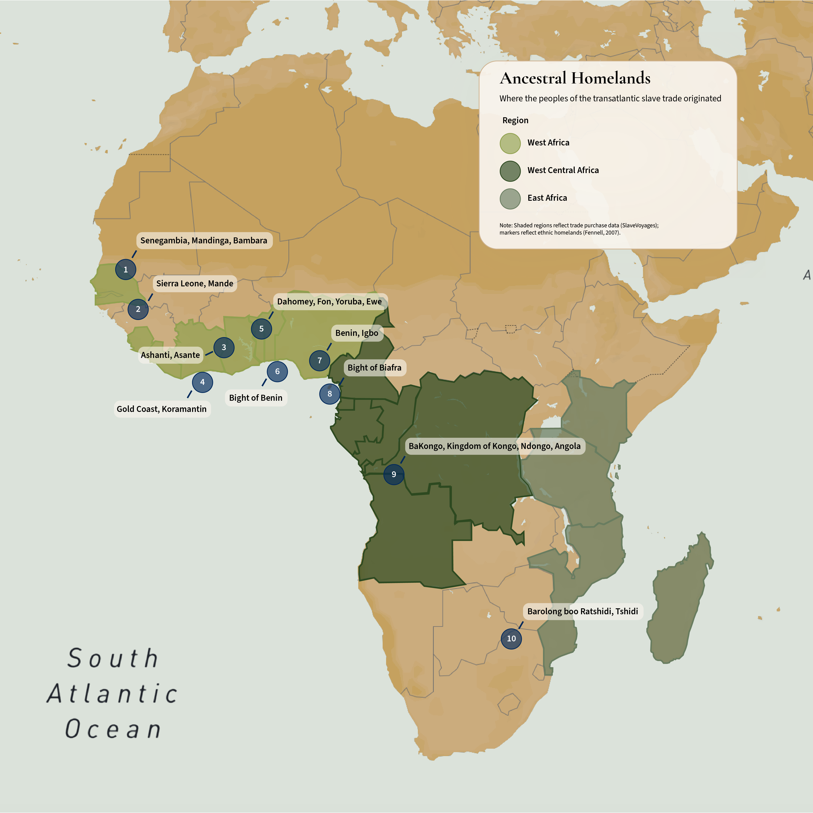
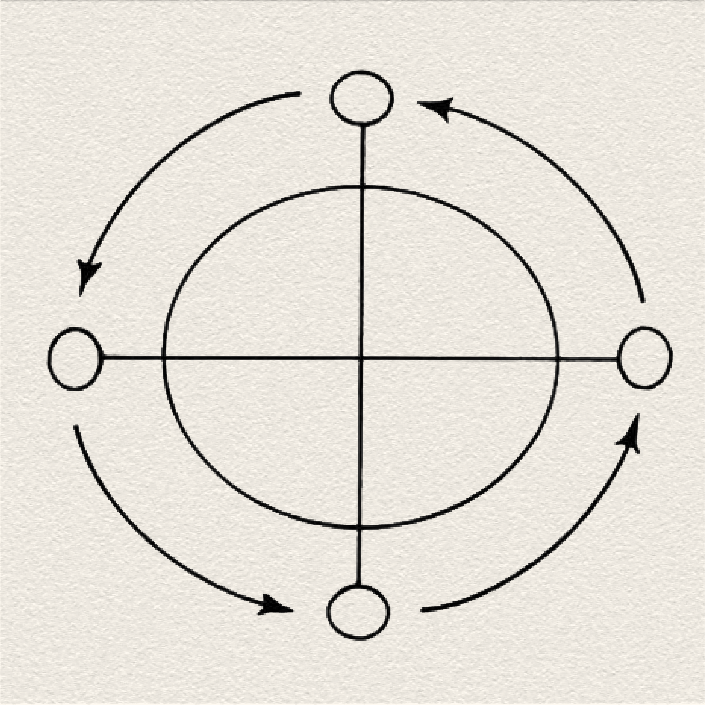

```{=html}
<link rel="preconnect" href="https://fonts.googleapis.com">
<link rel="preconnect" href="https://fonts.gstatic.com" crossorigin>

<link
  href="https://fonts.googleapis.com/css2?family=Cormorant+Garamond:wght@500;600;700&family=Source+Sans+3:wght@300;400;500;600&display=swap"
  rel="stylesheet"
>

<style>
:root {
  --paper: #F9F5EE;
  --paper-transparent: rgba(249, 245, 238, 0.9);
  --ink: #1D2129;
}

html,
body {
  margin: 0;
  padding: 0;
  background: var(--paper);
  color: var(--ink);
  font-family: "Source Sans Pro", sans-serif;
}

h1,
h2,
h3 {
  font-family: "Cormorant Garamond", serif;
}

/* Hero */

.hero {
  position: relative;
  width: 100vw;
  min-height: 100vh;
  margin-left: calc(-50vw + 50%);
  display: grid;
  place-content: center;
  padding: 2rem;
  text-align: center;
  background-image: url('images/ring_shout.png');
  background-size: cover;
  background-position: center;
  background-repeat: no-repeat;
  animation: slow-zoom 20s ease-in-out infinite alternate;
}

@keyframes slow-zoom {
  from { background-size: 100%; }
  to { background-size: 115%; }
}

@media (prefers-reduced-motion: reduce) {
  .hero {
    animation: none;
    background-size: 105%;
  }
}

.hero h1 {
  margin: 0;
  font-size: clamp(4rem, 9vw, 7rem);
  line-height: 0.95;
}

.hero h1,
.hero h2,
.hero p {
  position: relative;
  z-index: 1;
}

.hero::before {
  content: "";
  position: absolute;
  inset: 0;
  background: rgba(249, 245, 238, 0.75);
  z-index: 0;
}

.hero {
  position: relative;
  min-height: 100vh;
  ...
}

.hero h2 {
  max-width: 800px;
  margin: 1rem auto 2rem;
  font-size: clamp(1.5rem, 3vw, 2.5rem);
  font-weight: 500;
}

.hero h2 {
  border-bottom-color: rgba(29, 33, 41, 0.3);
}

/* Pinned map images */

.cr-section img {
  max-width: 900px;
  width: 100%;
  height: auto;
  display: block;
  margin: 0 auto;
  object-fit: contain;
}

/* Narrative cards */

.cr-section .map-step {
  width: min(500px, calc(100vw - 3rem));
  box-sizing: border-box;
  margin-left: 2rem;
  padding: 2rem;
  background: var(--paper-transparent);
  border-radius: 16px;
  box-shadow: 0 10px 30px rgba(0, 0, 0, 0.2);
}

.map-step h1,
.map-step h2 {
  margin-top: 0;
}

@media (max-width: 700px) {
  .map-step {
    width: calc(100vw - 2rem);
    margin-left: 1rem;
    padding: 1.5rem;
  }
}

.cr-section,
.cr-section > * {
  background: var(--paper);
}

.side-by-side {
  display: grid;
  grid-template-columns: 350px 1fr;
  gap: 2rem;
  align-items: start;
  max-width: 1800px;
  margin: 4rem auto;
  padding: 0 2rem;
}

.side-by-side .side-text {
  position: sticky;
  top: 2rem;
}

.side-by-side .side-chart {
  width: 100%;
}

@media (max-width: 800px) {
  .side-by-side {
    grid-template-columns: 1fr;
  }

  .side-by-side .side-text {
    position: static;
  }
}

.timeline-section {
  width: 100vw;
  max-width: 1600px;
  margin: 4rem auto;
  padding: 0 2rem;
  position: relative;
  left: 50%;
  transform: translateX(-50%);
}

.timeline-img {
  width: 100%;
  height: auto;
  display: block;
  border-radius: 8px;
}

.page-section {
  padding-block: 4rem;
}

.content h1,
.content h2,
.content h3,
.content p {
  max-width: 1000px;
  margin-left: auto;
  margin-right: auto;
}

.pull-quote {
  max-width: 900px;
  margin: 0 auto;
  padding: 2rem;
  border: none;
  border-top: 1px solid rgba(29, 33, 41, 0.25);
  border-bottom: 1px solid rgba(29, 33, 41, 0.25);
  font-family: "Cormorant Garamond", serif;
  font-style: italic;
  font-weight: 600;
  font-size: clamp(1.75rem, 3.2vw, 2.75rem);
  line-height: 1.35;
  text-align: center;
  color: var(--ink);
}

.pull-quote-img {
  display: block;
  max-width: 100%;
  height: auto;
  margin: 0 auto 1.5rem;
  border-radius: 8px;
}

.resources-section {
  max-width: 900px;
  margin: 0 auto;
}
.resources-section h3 {
  margin-top: 2rem;
  font-size: 1.3rem;
}
.resources-section ul {
  font-size: 0.95rem;
  line-height: 1.6;
  color: var(--ink);
  padding-left: 1.2rem;
}
.resources-section li {
  margin-bottom: 0.5rem;
}

.back-to-top {
  position: fixed;
  bottom: 2rem;
  left: 50%;
  transform: translateX(-50%) translateY(10px);
  display: flex;
  align-items: center;
  gap: 0.5rem;
  padding: 0.75rem 1.5rem;
  border-radius: 999px;
  background: var(--paper-transparent);
  color: var(--ink);
  border: 1px solid rgba(29, 33, 41, 0.15);
  box-shadow: 0 10px 30px rgba(0, 0, 0, 0.2);
  font-family: "Source Sans 3", sans-serif;
  font-size: 0.95rem;
  font-weight: 500;
  letter-spacing: 0.02em;
  cursor: pointer;
  opacity: 0;
  pointer-events: none;
  transition: opacity 0.25s ease, transform 0.25s ease;
  z-index: 500;
}
.back-to-top.visible {
  opacity: 1;
  pointer-events: auto;
  transform: translateX(-50%) translateY(0);
}
@media (max-width: 700px) {
  .back-to-top {
    bottom: 1.25rem;
    padding: 0.6rem 1.25rem;
    font-size: 0.85rem;
  }
}

.scroll-progress-track {
  position: fixed;
  top: 0;
  left: 0;
  width: 100%;
  height: 6px;
  background: rgba(29, 33, 41, 0.08);
  z-index: 2000;
}
.scroll-progress-bar {
  height: 100%;
  width: 0%;
  background: var(--ink);
  transition: width 0.1s ease-out;
}

.wiki-link {
  color: var(--ink);
  text-decoration: underline;
  text-decoration-color: rgba(29, 33, 41, 0.4);
  text-underline-offset: 3px;
}
.wiki-link:hover {
  text-decoration-color: var(--ink);
}

.term {
  position: relative;
  border-bottom: 1px dotted rgba(29, 33, 41, 0.5);
  cursor: help;
}
.term .tooltip {
  visibility: hidden;
  opacity: 0;
  position: absolute;
  bottom: 125%;
  left: 50%;
  transform: translateX(-50%);
  width: 260px;
  max-width: 260px;
  background: var(--paper);
  color: var(--ink);
  border: 1px solid rgba(29, 33, 41, 0.15);
  box-shadow: 0 10px 30px rgba(0, 0, 0, 0.2);
  border-radius: 8px;
  padding: 0.75rem 1rem;
  font-size: 0.9rem;
  line-height: 1.4;
  font-family: "Source Sans 3", sans-serif;
  text-align: left;
  z-index: 10;
  transition: opacity 0.2s ease;
  pointer-events: none;
}
.term:hover .tooltip,
.term:focus .tooltip {
  visibility: visible;
  opacity: 1;
}

.page-section + .page-section {
  padding-top: 0;
}

.cr-section .flourish-embed,
.cr-section .flourish-embed iframe {
  width: 100% !important;
  max-width: none !important;
  margin: 0 auto;
  display: block;
}
.sticky-col-stack {
  grid-template-columns: 1fr;
}
.sticky-col-stack,
#cr-whos-who-cards {
  width: 100%;
  min-width: 0;
}

.tooltip-img {
  display: block;
  width: 150px;
  height: auto;
  margin: 0 auto 0.5rem;
}

.video-link {
  text-decoration: underline;
  text-decoration-style: dotted;
  text-underline-offset: 3px;
  cursor: pointer;
  color: var(--ink);
}
.video-link:hover {
  opacity: 0.7;
}
.video-modal-overlay {
  display: none;
  position: fixed;
  inset: 0;
  background: rgba(0, 0, 0, 0.75);
  z-index: 1000;
  align-items: center;
  justify-content: center;
  padding: 2rem;
}
.video-modal-content {
  position: relative;
  max-width: 90vw;
}
.video-modal-content iframe {
  width: min(800px, 85vw);
  height: auto;
  aspect-ratio: 16 / 9;
  display: block;
  border-radius: 8px;
}
.video-modal-close {
  position: absolute;
  top: -2.5rem;
  right: 0;
  background: none;
  border: none;
  color: var(--paper);
  font-size: 2rem;
  line-height: 1;
  cursor: pointer;
}

.site-footer {
  text-align: center;
  padding: 3rem 2rem;
  font-size: 0.9rem;
  color: var(--ink);
  opacity: 0.7;
}
.site-footer p {
  margin: 0.25rem 0;
}
</style>
```

::: {.hero}

# Making A Way

## Tracing the African Origins and Development of Hoodoo Cultural Traditions in the United States

<p class="hero-byline">Christina Greer · MPS Data Analytics & Visualization</p>


Scroll to begin ↓


:::

```{=html}
<div class="scroll-progress-track">
  <div class="scroll-progress-bar" id="scroll-progress-bar"></div>
</div>
<script>
window.addEventListener('scroll', function() {
  var scrollTop = window.scrollY;
  var docHeight = document.documentElement.scrollHeight - window.innerHeight;
  var progress = docHeight > 0 ? (scrollTop / docHeight) * 100 : 0;
  document.getElementById('scroll-progress-bar').style.width = progress + '%';
});
</script>
```

<!-- ============================================================ -->
<!-- Introduction                                                 -->
<!-- ============================================================ -->

:::: {.page-section}

## Welcome

It's no mistake that you have arrived here today. If you're anything like me, you're here because you've already heard the whispers... and now you're curious. 

For many of us, there is a second coming of age that involves unlearning old worldviews, embracing new perspectives, and recontextualizing our identities. So, allow me to introduce you to the often misunderstood tradition called Hoodoo. 

Here's what you need to know:

**Hoodoo**, also known as "*conjure*" or "*root work*," is a spiritual folk tradition created by enslaved African Americans in the southern United States that is directly influenced by West and West-Central African religions. It is used to govern all aspects of life including mental, spiritual, and physical health, financial and legal issues, and to protect against hardships, curses, and hexes.

It isn't considered a religion in an institutional sense, but it is a system of practical knowledge passed down and adapted across generations. Its formation and preservation in the New World relied on persistence, secrecy, and making do with available resources. 

That secrecy often meant blending African traditions directly into Christian worship — a process called religious syncretism. The clearest example is the Ring Shout, whose call-and-response shaped early African American worship and survives today in Sanctified, or Holiness-Pentecostal, churches, including the Church of God in Christ (COGIC), the largest historically Black Pentecostal denomination. This worship style, deeply influenced by Hoodoo, is marked by exuberant expressions of faith — singing, dancing, and ecstatic praise — along with practices like feet washing, communion, full immersion baptism, and speaking in tongues.

The <span class="video-link" onclick="document.getElementById('video-modal').style.display='flex'">Ring Shout's</span> path — from a hidden nighttime ritual to the beating heart of one of the largest Black denominations in America — captures something essential about Hoodoo itself. This is a story not just of survival, but of ingenuity, creativity, and supernatural power — one in which enslaved and free Black communities built a spiritual practice resilient enough to withstand every mechanism designed to destroy it, and vital enough to forge new traditions of healing, resistance, and belonging that still shape Black spiritual life today.

```{=html}
<div id="video-modal" class="video-modal-overlay" onclick="if(event.target===this){this.style.display='none'; this.querySelector('iframe').src=this.querySelector('iframe').src;}">
  <div class="video-modal-content">
    <button class="video-modal-close" onclick="document.getElementById('video-modal').style.display='none'; this.parentElement.querySelector('iframe').src=this.parentElement.querySelector('iframe').src;">×</button>
    <iframe width="560" height="315" src="https://www.youtube.com/embed/NQgrIcCtys0?si=gVUUtCiBa-O76-Cz" title="YouTube video player" frameborder="0" allow="accelerometer; autoplay; clipboard-write; encrypted-media; gyroscope; picture-in-picture; web-share" referrerpolicy="strict-origin-when-cross-origin" allowfullscreen></iframe>
</div>
```

::::

<!-- ============================================================ -->
<!-- African Religion Complex — Cards                              -->
<!-- ============================================================ -->

:::: {.page-section}
## The African Religion Complex

Scholar Katrina Hazzard-Donald identifies eight unifying spiritual practices shared across diverse African ethnic and religious traditions, forming the foundation from which Hoodoo developed. These practices took shape within a broader worldview that included belief in a Supreme Being, no firm separation between the sacred and the secular, and a structured social hierarchy.

*Click on a card to see a description of each practice.*

```{=html}
<div class="flourish-embed flourish-cards" data-src="visualisation/29917916">
  <script src="https://public.flourish.studio/resources/embed.js"></script>
  <noscript>
    
  </noscript>
</div>
```

::::

<!-- ============================================================ -->
<!-- Continental overview                                         -->
<!-- ============================================================ -->

:::: {.cr-section .page-section layout="sidebar-left"}

::: {#cr-africa_ethnicities-img}


:::

::: {focus-on="cr-africa_ethnicities-img" .map-step}

# African Origins

The people forced across the Atlantic came from dozens of distinct ethnic groups — each with its own language, <span class="term" tabindex="0">cosmology<span class="tooltip">A belief system's account of how the universe is structured and ordered, including the relationship between the physical world, the spirit world, ancestors, and divine forces.</span></span>, and way of understanding the sacred.

↓
:::

::: {focus-on="cr-africa_ethnicities-img" .map-step scale-by="3" pan-to="65%,45%"}

## Bambara

The Bambara of Senegambia (1) held a spiritual worldview built on intimacy between the earth, the spirit world, and human beings. They were especially noted for their use of *amulets and charms* — objects of intercession and divination that carried protective and revealing power.

↓

:::

::: {focus-on="cr-africa_ethnicities-img" .map-step scale-by="3" pan-to="30%,20%"}

## Yoruba

Among West Africa's many peoples, the Yoruba (5) stand out as one of the most significant influences on what would become Hoodoo — their systems of divination, herbal knowledge, and reverence for spirit carried directly into Black American spiritual practice.

↓

:::

::: {focus-on="cr-africa_ethnicities-img" .map-step scale-by="3" pan-to="-25%,-25%"}

## Kongo-Angola

The Kongo-Angolans (9) of West-Central Africa left an equally deep mark. The <span class="term" tabindex="0"><em>Kongo cosmogram</em>
  <span class="tooltip">
    **Dikenga dia Kongo** also known as the **Kongo cosmogram** or **Yowa cross**, is a sacred spiritual symbol of the Bakongo culture. It is said to be the dominate influence on the counterclockwise circle dance or “Ring Shout”, although many other West African religions included sacred circle dancing.
  </span>
</span> — a cross marking the boundary between the living and the spirit world — echoes throughout Hoodoo ritual to this day.

↓

:::


::: {focus-on="cr-africa_ethnicities-img" .map-step}

## Shared Foundations

Every ethnic group carried its own distinct traditions — yet across the continent, certain spiritual foundations recur. The Akan (4) and the Igbo (7), for example, both hold a deep reverence for earth mothers, a belief that unites people to land and to ancestors in the same breath.

↓

:::

::::

<!-- ============================================================ -->
<!-- Regional Origins Chart                                        -->
<!-- ============================================================ -->

:::: {.chart-wide .page-section}

## Where Our Ancestors Came From

The import of particular ethnic groups varied over time. This was largely due to slaveholder preferences and local <span class="term" tabindex="0"><em>ecology</em><span class="tooltip">The web of relationships between people, plants, land, and natural forces — understood in many African and African American spiritual traditions as inherently spiritual, not merely biological.</span></span>. For example, it is theorized that planters in South Carolina preferred Africans from the Windward Coast (Sierra Leone) and Senegambia because of their knowledge of rice cultivation. Rice became a principal crop in the region, and after 1700, the Carolina colony increasingly acquired direct shipments of these particular ethnic groups from Africa.

These patterns shaped more than the fields. The same climate and crops that made a region valuable for a particular agricultural skill also determined what plants were available for healing and ritual, how time was marked by planting and harvest seasons, and even how people dressed. And where one or two ethnic groups came to dominate a region during a given period — even as traditions melded across groups — their particular practices left a deeper imprint on what would take root locally as Hoodoo.


```{=html}
<div class="flourish-embed flourish-chart" data-src="visualisation/29824259">
  <script src="https://public.flourish.studio/resources/embed.js"></script>
  <noscript>
    
  </noscript>
</div>
```

::::

<!-- ============================================================ -->
<!-- Sankey Diagram                                                -->
<!-- ============================================================ -->

:::: {.page-section}
## Tracing Documented Connections Across the Atlantic

Each line in this diagram traces a documented route — a specific African region connected to a specific American colony. West-Central Africa and St. Helena formed the largest recorded source region, while South Carolina and Virginia received the greatest number of documented enslaved persons.

These routes were not evenly distributed. Colonies drew disproportionately from different African regions, shaped by the same forces already at work — the crops a colony grew, the skills its planters sought, the ports it traded through most often. The result was not one uniform culture taking root in North America, but many regional variations, each shaped by which African peoples arrived there in the greatest numbers, and what knowledge they carried with them.

*Hover over a line to see how many people were forcibly transferred between regions.*

```{=html}
<div class="flourish-embed flourish-sankey" data-src="visualisation/29490123">
  <script src="https://public.flourish.studio/resources/embed.js"></script>
  <noscript>
    
  </noscript>
</div>
```

<br>

## Black Belt Hoodoo: Developing Traditions in the American South

The continued influx of newly enslaved Africans ensured that Hoodoo would evolve with each new arrival. Before the rise of cotton in 1807, there were more distinct regional and African ethnic differences in the daily lives of the enslaved.

::::


<!-- ============================================================ -->
<!--Hoodoo cultural clusters                                      -->
<!-- ============================================================ -->

:::: {.cr-section .page-section layout="sidebar-left"}

::: {#cr-hoodoo-clusters-img}

:::

::: {focus-on="cr-hoodoo-clusters-img" .map-step}

## Regional Traditions Take Shape

By the early 19th century, Hoodoo had taken on distinct regional characteristics. Climate, crop ecology, the structure of the local slave economy, and the size and density of plantation communities all shaped which traditions took deepest root — as did the particular skills colonists sought in the people they enslaved. Interaction with Native American and European folk and religious traditions left their own mark as well.

↓

:::

::: {focus-on="cr-hoodoo-clusters-img" .map-step scale-by="2" pan-to="-65%,30%"}

## Northeast

**States:** Maryland, Virginia, North Carolina, Tenneessee
<br>
**Crops:** Tobacco, Corn, Wheat
<br>
**Notable influences:** Akan people, people from the Gold Coast (Ghana) and Bight of Biafra (coasts of Nigeria, Cameroon, Equatorial Guinea, and northern Gabon), Kongo-Angola
<br>
**Significance:** Colonists in this region targeted Africans with skills in ironworking, maritime expertise, and harvesting leafy plants. Ironworking was an honored craft among the Bakongo people, as they believed it involved applying mystical powers to transform materials. The Yoruba placed great emphasis on the use of iron materials in religious objects. In hoodoo, special skill sets such as this would influence status within the community just as they would in African traditional religions.

↓

:::

::: {focus-on="cr-hoodoo-clusters-img" .map-step scale-by="2" pan-to="-65%,-30%"}

## Southeast

**States:** South Carolina, Georgia, Florida
<br>
**Crops:** Rice, Indigo
<br>
**Notable influences:** Sierra Leone, Kongo-Angola, Igbo people (Nigeria)
<br>
**Significance:** While multiple African ethnic groups shaped this region, West-Central African (Kongo) cosmology became a dominant and enduring influence across the South. Along the Lowcountry coast, relative isolation on rice plantations and sea islands allowed Gullah Geechee culture to develop and endure with unusual continuity — preserving language, foodways, and spiritual practice more directly tied to their African origins than almost anywhere else in North America.

↓

:::

::: {focus-on="cr-hoodoo-clusters-img" .map-step scale-by="2" pan-to="15%,-5%"}

## Southwest

**States:** Missouri, Texas, Louisiana, Mississippi, Alabama
<br>
**Crops:** Cotton, Sugarcane
<br>
**Notable influences:** Senegambian Mande speakers (Bambara), Yoruba, Fon, Ewe speakers (modern-day Nigeria, Benin, Ghana, and Togo), Kongo-Angola-Zaire
<br>
**Significance:** Represents the inland and Gulf expansion of Hoodoo. The Bambara people were so numerous in Louisiana that their contributions to the development of Hoodoo left a widely recognized cultural legacy.

↓

:::

::::

<!-- ============================================================ -->
<!-- Practices and Beliefs — Network Diagram                      -->
<!-- ============================================================ -->

:::: {.page-section}
## The Ritual Network

Spiritual control, community regulation, protection from harm, the attraction of good fortune, and herbal healing all shaped the role of Hoodoo within enslaved communities.

That spiritual practice grew out of belief systems carried forward from African religions. One central concept is that plants, animals, natural places, and objects can hold spiritual presence, power, or agency. This worldview shaped many of the practices that later developed within Hoodoo.

In Yoruba religion, for example, <span class="term" tabindex="0"><em>orishas</em><span class="tooltip">A divine being or spiritual force in Yoruba religion, believed to guide humanity and govern specific aspects of life and the natural world on behalf of the Supreme Being.</span></span> are divine beings or forces created by the Supreme Being to guide humanity and govern different aspects of life and the natural world. Certain orishas are also associated with parts of the body, medicinal herbs, and natural substances used for healing. Hoodoo reflects a similar understanding that herbs and other natural materials possess spiritual power that can be used to diagnose and treat ailments, offer protection, and influence personal or community matters.

Hoodoo's core rituals rarely stand alone — ancestor reverence, water immersion, and prayer weave together into a connected system of practice. Practitioners believed the spoken word held spiritual potency, which is why prayers accompanied the preparation of medicine or the tying of sacred string for healing. Singing and shouting could invoke the ancestors and lead to spirit possession in the sacred <a href="https://en.wikipedia.org/wiki/Ring_shout" class="wiki-link" target="_blank" rel="noopener">Ring Shout</a> or during divination rituals. 

*Hover over a circle to learn more about each practice.*


```{=html}
<div class="flourish-embed flourish-network" data-src="visualisation/29797299">
  <script src="https://public.flourish.studio/resources/embed.js"></script>
  <noscript>
    
  </noscript>
</div>
```
::::

::::{.page-section}

```{=html}
<blockquote class="pull-quote">
"The African priest, who would evolve into the plantation conjurer, and later the plantation's black preacher possessed with spiritual power in the Shout."
</blockquote>
```

::::

<!-- ============================================================ -->
<!-- Timeline                                                      -->
<!-- ============================================================ -->

:::: {.timeline-section }

## The Evolution of Hoodoo

The development of Hoodoo was by no means a straightforward process. It was ever evolving under the conditions of chattel slavery in the New World. Its presence was secretive and oftentimes invisible. It began with the fragmentation and breakdown of West African religious systems, otherwise known as "the death of the Gods." What happened thereafter depended upon the bondsmen's ability to preserve and pass down sacred knowledge.

Running concurrently with the disruption of traditional spiritual continuity was interethnic assimilation among enslaved Africans and an openness to integrating external beliefs and practices, along with substituting ritual items. Eventually, cotton production would reign supreme across the South. This would modify the material culture across the <span class="term" tabindex="0"><em>black belt</em><span class="tooltip">A swath of the southeastern United States named for its dark, fertile soil, which became home to a dense concentration of enslaved and later free Black communities due to the plantation economy.</span></span>, causing the lives of the enslaved to become more similar and leading to the homogenization of the three regional Hoodoo traditions.

Below is a timeline highlighting some of the major factors that contributed to the development of Hoodoo in America. While it is not all-encompassing, it provides a general overview of how Hoodoo evolved over time within its broader historical context.

<br>

```{=html}

```

::::

:::: {.cr-section .page-section layout="sidebar-left"}

::: {#cr-whos-who-cards}
```{=html}
<div class="flourish-embed flourish-cards" data-src="visualisation/29929959">
  <script src="https://public.flourish.studio/resources/embed.js"></script>
  <noscript>
    
  </noscript>
</div>
```
:::

::: {focus-on="cr-whos-who-cards" .map-step}
During the second phase of Hoodoo’s development, established traditions stabilized and gained a national profile. Hoodoo entered the mainstream commercial market, attracting new practitioners and exploiters while generating many of the myths and legends associated with the tradition today. 

↓

:::

::: {focus-on="cr-whos-who-cards" .map-step}

This is a glimpse into the "who's who" of  Hoodoo— the curios that carry spiritual power, the specialized roles that gave the tradition its structure, and the notable figures who practiced and preserved it.

↓

:::

::: {focus-on="cr-whos-who-cards" .map-step}

Many other important figures, plants, and specialized roles are part of Hoodoo’s history. Visit the resources section to continue exploring the tradition.

↓

:::

::::

:::: {.page-section}

## Making A Way

Hoodoo survived by moving quietly — through folktales, oral history, and traditions practiced in secret, blending African, Christian, and Indigenous belief into something entirely its own. For many of us, it was <span class="term" tabindex="0"><em>ubiquitous</em><span class="tooltip">Present or found everywhere — woven into everyday culture so thoroughly that its presence often goes unrecognized.</span></span> long before it had a name: present in a grandmother's remedy, a warning never explained, a habit no one questioned — until an elder or a peer finally gave it language, context, and history.

That history is still being written. Hoodoo is being rediscovered online, studied by scholars, and made newly visible — sometimes reverently, sometimes commercially. But its survival was never in anyone else's hands. It belongs to the people who practice it, adapt it, and choose, generation after generation, to carry it forward.

<span class="term" tabindex="0"><em>Sankofa
  </em><span class="tooltip">
    
    An Akan concept, often symbolized by a heart or bird looking backward, meaning "go back and get it" — the idea that you must reach into the past to move forward.
  </span>
</span> teaches us to look back so that we may move forward. In that spirit, learn more about the histories, voices, and sources behind this story.
[Learn more →](#resources)

::::

<!-- ============================================================ -->
<!-- Resources                                                     -->
<!-- ============================================================ -->

:::: {.page-section .resources-section}
## Resources

### Print Sources

Bae, J. (2024). The book of Juju: Africana spirituality for healing, liberation, and self-discovery. Sterling Ethos.

Chireau, Y. P. (2003). Black magic: Religion and the African American conjuring tradition. University of California Press.

Fennell, C. C. (2007). Crossroads and cosmologies: Diasporas and ethnogenesis in the New World. University Press of Florida.

Gates, H. L., & Tatar, M. (2018). The annotated African American folktales. (First edition). Liveright Publishing Corporation, a division of W. W. Norton & Company.

Gomez, M. A. (1998). Exchanging our country marks: The transformation of African identities in the colonial and antebellum South. University of North Carolina Press.

Hamilton, V. (1985). The people could fly: American Black folktales (L. Dillon & D. Dillon, Illus.). Knopf.

Hurston, Z. (1931). Hoodoo in America. Journal of American Folklore, 44(174), 317. https://doi.org/10.2307/535394

Lee, M. E. (2017). Working the roots: Over 400 years of traditional African American healing. Wadastick.

VanDyke, L. (2022). African American herbalism: A practical guide to healing plants and folk traditions. Ulysses Press.

Virginia General Assembly. “An Act Declaring That Baptisme of Slaves Doth Not Exempt Them from Bondage.” September 1667.   In William Waller Hening, ed., The Statutes at Large, vol. 2, p. 260, 1823.

<br>

### Online Sources

Black Herman. (Year, Month Day). In Wikipedia. <https://en.wikipedia.org/wiki/Black_Herman>

Brooks, K. D. (2024). Haints, hollers, and hoodoo. Southern Cultures, 29(4). <https://www.southerncultures.org/article/haints-hollers-and-hoodoo/>

Bullard, E. (2022). Yoruba people. EBSCO Research Starters. <https://www.ebsco.com/research-starters/ethnic-and-cultural-studies/yoruba-people>

Chesapeake Conjure Society. (n.d.). Regional Hoodoo. Hoodoo Society. <https://hoodoosociety.com/regional-hoodoo>

Chireau, Y. (n.d.). What is Hoodoo? Professor Chireau's Academic Hoodoo. <https://academichoodoo.com/>

Gecewicz, C. (2021, February 16). A brief overview of Black religious history in the U.S. Pew Research Center. <https://www.pewresearch.org/religion/2021/02/16/a-brief-overview-of-black-religious-history-in-the-u-s/>

Hall, S. (2019, August 28). Beyond 1619: Slavery and the cultures of America. Library of Congress Blogs: Folklife Today. <https://blogs.loc.gov/folklife/2019/08/beyond-1619/>

Harvard University. (2023, February). The Great Migration. <https://www.harvard.edu/in-focus/the-great-migration/>

McDonald, C. (2018). African musical traditions in American popular music. In Music in Global America. University of Southern California. <https://scalar.usc.edu/works/music-in-global-america/african-musical-traditions-in-american-popular-music>

National Archives and Records Administration. (2021, May 20). The Great Migration (1910–1970). <https://www.archives.gov/research/african-americans/migrations/great-migration>

National Park Service. (2021, November 23). Hoodoo in St. Louis: An African American religious tradition. U.S. Department of the Interior. <https://www.nps.gov/articles/000/hoodoo-in-st-louis-an-african-american-religious-tradition.htm>

Nicole, J. (2026, June 20). Discussion/study guide: Mojo Workin' – Prescript, Ch. 1 & 2. Jay's Divine Readings. <https://jaysdivinereadings.com/2026/06/20/discussion-study-guide-mojo-workin-prescript-ch-1-2/>

Powers, B. E., Jr. (2023, August 23). Ring shouts. South Carolina Encyclopedia. <https://www.scencyclopedia.org/sce/entries/ring-shouts/>

Puckett, N. N. (1926). Folk beliefs of the southern Negro. University of North Carolina Press. <https://archive.org/details/folkbeliefsofsou00puck>

Scott, B. (2022). From the sky to the rivers. The Nature Conservancy. <https://www.nature.org/en-us/about-us/where-we-work/united-states/virginia/stories-in-virginia/sky-rivers-nature-black-america/>

Shawler, C. R. (2024, February 9). Demystifying Hoodoo: Spiritual tradition of resistance teaches ancestral connections. The Oberlin Review. <https://oberlinreview.org/31800/arts/demystifying-hoodoo-spiritual-tradition-of-resistance-teaches-ancestral-connections/>

Whitcomb, L. N. (2022, October 18). Hoodoo heritage month: Conjuring, culture, and community. MadameNoire. <https://madamenoire.com/1325640/hoodoo-heritage-month/>

### Software

AI language models — ChatGPT (OpenAI) and Claude (Anthropic) — were used to edit select passages of this project's narrative text for clarity and flow, and to assist in troubleshooting and refining code. Data analysis and visualization were conducted using R, and this project's interactive scrollytelling format was built using Quarto (closeread-html). Adobe Illustrator was used to design the project's maps and timeline graphics.

Adobe Inc. (2026). Adobe Illustrator [Computer software]. https://www.adobe.com/products/illustrator.html

Allaire, J. J., Teague, C., Scheidegger, C., Xie, Y., & Dervieux, C. (2024). Quarto (Version 1.10.18) [Computer software]. https://doi.org/10.5281/zenodo.5960048

Anthropic. (2026). Claude [Large language model]. https://claude.ai

OpenAI. (2026). ChatGPT [Large language model]. https://chatgpt.com

R Core Team. (2026). R: A language and environment for statistical computing. R Foundation for Statistical Computing. https://www.R-project.org/

### Data Credits

Ancestral Homelands map adapted from Fennell, *Crossroads and cosmologies: Diasporas and ethnogenesis in the New World* (2007), Figure 1.2.

Data visualizations created with [Flourish](https://flourish.studio).
 
SlaveVoyages. (2024). *Trans-Atlantic Slave Trade Database*. <https://www.slavevoyages.org>

::::

<!-- ============================================================ -->
<!-- Statement of Gratitude                                       -->
<!-- ============================================================ -->

:::: {.page-section}
## Statement of Gratitude

Thank you to everyone who has supported the creation of this project — family, dear friends, peers, instructors, practitioners, scholars, and the ancestors that laid the path. May we all continue to grow in love, knowledge, and power. *Ashe. Amen.*
::::

```{=html}
<button id="back-to-top" class="back-to-top" onclick="window.scrollTo({top: 0, behavior: 'smooth'})">
  <span aria-hidden="true">↑</span> Back to top
</button>
<script>
window.addEventListener('scroll', function() {
  var btn = document.getElementById('back-to-top');
  if (window.scrollY > 800) {
    btn.classList.add('visible');
  } else {
    btn.classList.remove('visible');
  }
});
</script>
```

```{=html}
<footer class="site-footer">
  <p>Christina Greer</p>
  <p>MPS Data Analytics & Visualization, MICA Summer 2025 Cohort</p>
</footer>
```